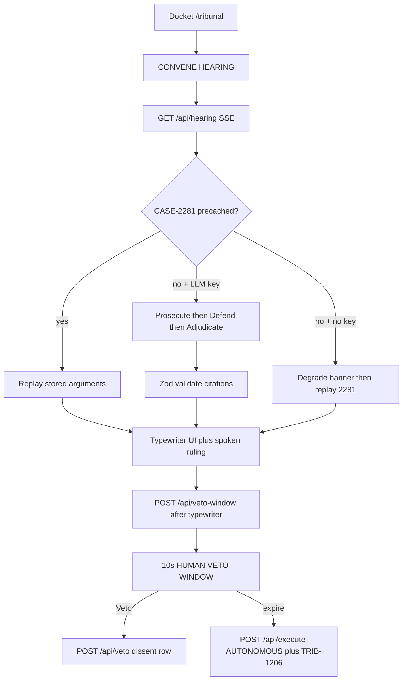

# TRIBUNAL

**A machine court for production incidents.**

We already let AI agents act on production systems. We never built the part where they
have to justify it — and we never asked what happens when the human’s right to say no
has an expiration date.

**Repo:** [github.com/UjwalKandi/tribunal](https://github.com/UjwalKandi/tribunal)  
**Local demo:** `http://localhost:3000/tribunal` (no cloud deploy in this checkout)

---

## Quick start

```bash
git clone https://github.com/UjwalKandi/tribunal.git
cd tribunal
npm install
npm run dev
# open http://localhost:3000/tribunal
```

No API keys required for the recorded demo path (**CASE-2281**).

Optional live hearing (CASE-4417) and Supabase persistence:

```bash
cp .env.example .env.local
# fill keys (see Reproduce the demo)
npm run dev
```

---

## Tech stack

| Layer | Choice |
|---|---|
| App | Next.js 15 (App Router), TypeScript, Tailwind, shadcn/ui |
| Court | Three LLM roles via `lib/llm.ts` (OpenAI or Groq JSON mode), Zod validation |
| Memory | Fixture corpus in `fixtures/` today; `supabase/schema.sql` for Postgres + pgvector |
| Voice | Browser `window.speechSynthesis` only (no paid TTS) |
| Streaming | Server-Sent Events (`GET /api/hearing`) |



---

## Reproduce the demo

1. `npm install && npm run dev`
2. Open `/tribunal`. Voice **On**. Pick **CASE-2281** → **CONVENE HEARING**.
3. Watch Prosecution, Defense (cited `TRIB-*` + similarity), Judge (serif + speech).
4. Do **not** click Veto. After **10 seconds** the ruling executes under `AUTONOMOUS` authority and the counter becomes **1,206**.

That path uses embedded fixtures. Unset `OPENAI_API_KEY` / `GROQ_API_KEY` to prove zero model calls.

### Sample `.env.local`

Copy from [`.env.example`](.env.example):

```
NEXT_PUBLIC_SUPABASE_URL=
NEXT_PUBLIC_SUPABASE_ANON_KEY=
SUPABASE_SERVICE_ROLE_KEY=
OPENAI_API_KEY=
GROQ_API_KEY=
TRIBUNAL_CHAT_MODEL=gpt-4o-mini
TRIBUNAL_EMBED_MODEL=text-embedding-3-small
```

Leave blank for fixture mode. With `OPENAI_API_KEY` or `GROQ_API_KEY`, convene **CASE-4417** after 2281 executes to try a live ruling that can cite the new precedent. Apply [`supabase/schema.sql`](supabase/schema.sql) only if you want a real database (`npm run seed` / `npm run precache`).

Rebuild GitHub fixtures (optional): `npm run fetch-issues && npm run generate-corpus`.

---

## Datasets and provenance

| Asset | Source | What’s real | What’s synthesized |
|---|---|---|---|
| CASE-2281 | [dbt #16331](https://github.com/dbt-labs/dbt/issues/16331) | Issue body excerpt in `raw_log` | Hearing arguments, verdict metadata |
| CASE-3104 | [Airflow #66786](https://github.com/apache/airflow/issues/66786) | Issue body excerpt | — |
| CASE-4417 | [Airflow #66524](https://github.com/apache/airflow/issues/66524) | Issue body excerpt | Live LLM ruling if keyed |
| CASE-5002 | [Airflow #66715](https://github.com/apache/airflow/issues/66715) | Issue body excerpt | — |
| Precedent corpus | Public issues from `apache/airflow`, `dbt-labs/dbt-core`, `great-expectations` | Titles/summaries from 486 unique issues | 1,205 citation slots (padded); holdings mostly title-derived; verdict / outcome / MTTR weighted |

**No remediation is executed.** There is no write path to any pipeline or vendor API except optional LLM/embed calls.

---

## Known limitations and next steps

- Fixture mode, not live pgvector, unless you apply `supabase/schema.sql` and embed.
- Demo veto is **10 seconds** (pitch copy still uses sixty as the operational metaphor).
- CASE-4417 without an LLM key degrades to archived CASE-2281.
- Holdings are not fully LLM-extracted; padded citations reuse issue text.
- No auth, no production execution, no mobile layout, no appeals UI.
- No Vercel URL in this submission — judges should run locally or watch the Loom.

**Next:** point at a closed incident archive (Jira / PagerDuty export) in read-only advisory mode; measure agreement vs human RCAs; keep the autonomous execute path off until security review.

---

## Lineage

**A.I.D.E.** (Meta ATX Llama Hackathon, April 2024) diagnosed failures and had no authority and no memory. TRIBUNAL decides, justifies adversarially, can be overruled for ten seconds on stage, and binds the next hearing.

**Build the courtroom before you need it.**
