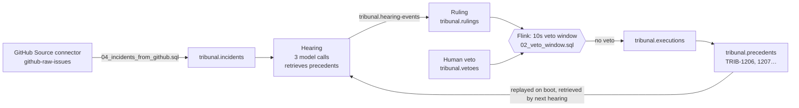

# TRIBUNAL on Confluent Cloud

## The idea

Automation pipelines spend their compute, inference and tokens on doing work,
and almost nothing on **deciding whether a production change should happen**.
That decision is the step that compounds. A bad call gets repeated, and a good
call is forgotten.

TRIBUNAL is a framework for giving that step its own budget and its own memory:

| Resource | What the decision step gets |
|---|---|
| **Inference / tokens** | Three adversarial model calls (Prosecution, Defense, Judge) instead of one-shot "fix it" |
| **Memory** | Every executed ruling becomes a precedent on `tribunal.precedents`. The log is the court's memory, and it survives restarts |
| **Compute** | A dedicated Flink compute pool enforces the human veto window. The app can't skip it |
| **Intake** | A fully managed GitHub Source connector streams real failures onto the docket |
| **Governance** | Schema Registry contracts on every topic, and Stream Lineage for the full audit trail |

The loop is recursive. Every decision is appended to the history, and every
later decision is argued against that history:

## What runs where

| Piece | Where |
|---|---|
| Kafka, Schema Registry, Flink, GitHub Source connector, Stream Lineage | Confluent Cloud (your environment) |
| Courtroom UI and the LLM calls | Next.js on your laptop, talking to Confluent Cloud |
| Topic contract | `lib/stream/topics.ts` |
| Memory and intake replay | `lib/stream/memory.ts` |
| Flink SQL | `confluent/flink/01–04` |

## Provision (web console, Google sign-in)

Menu labels may shift slightly between console releases. Copy each value into `.env.local`.

1. **Sign in** at confluent.cloud. Under **Billing & payment**, confirm the credit is there.
2. **Environment:** Environments → **Add cloud environment**. Name it `tribunal` and choose the **Essentials** governance package.
3. **Cluster:** **Add cluster** → **Basic** → AWS `us-east-1` → **Launch**.
4. **Kafka API key:** cluster → **API Keys** → **Create key** → *My account*.
   → `CONFLUENT_API_KEY`, `CONFLUENT_API_SECRET`.
   Cluster settings → *Bootstrap server*.
   → `CONFLUENT_BOOTSTRAP`.
5. **Topics:** create these 6, each with **1 partition**. The default is 6, and more partitions stall the veto window.
   `tribunal.incidents`, `tribunal.hearing-events`, `tribunal.rulings`, `tribunal.vetoes`, `tribunal.executions`, `tribunal.precedents`.
   Skip the data-contract prompt; step 8 registers the schemas.
6. **Schema Registry:** environment page, right-hand panel → **Stream Governance API** endpoint.
   → `SR_URL`.
   **Add key**.
   → `SR_API_KEY`, `SR_API_SECRET`.
7. **Flink:** environment → **Flink** → **Create compute pool**. Use the same region as the cluster and max 10 CFUs, then **Open SQL workspace** with catalog `tribunal` and database `tribunal`.
8. Laptop: add `TRIBUNAL_EXECUTOR=flink` and `ANTHROPIC_API_KEY` (or `OPENAI_API_KEY`) to `.env.local`, then run `npm run stream:schemas`.
9. Flink workspace: run `01_watermarks.sql`, then `02_veto_window.sql` and `03_metrics.sql`. Leave 02 and 03 **running**.
10. **Connector:** cluster → **Connectors** → **Add connector** → **GitHub Source**.
    - Create a GitHub personal access token (classic) with **no scopes** at github.com/settings/tokens. Public repos need none.
    - Repositories: `apache/airflow, dbt-labs/dbt-core`. Resources: `issues`.
    - Since: a date about **7 days ago**. This keeps the backfill small and the credit spend low.
    - Topic name pattern: `github-raw-${resourceName}`, so the topic is `github-raw-issues`. Output format: **JSON** (plain, not JSON_SR). Tasks: **1**.
      GitHub issues vary in shape; with JSON_SR the connector keeps registering new schema
      versions and Flink fails on the older records. Plain JSON plus `JSON_VALUE` in 04 avoids that.
    - Launch. When `github-raw-issues` → Messages shows records, run `04_incidents_from_github.sql` and leave it **running**.

## Demo script (about 3 minutes)

1. `npm run dev` → `/tribunal`. The counter reads **1,205** precedents.
   The top of the docket shows `GH-…` cases: live GitHub failures that came in through the connector.
2. Convene **CASE-2281**. Prosecution, Defense (citing precedent) and Judge argue. Don't veto.
3. The window closes and the band reads *"Window closed by Flink · TRIB-1206 binds every hearing that follows"*.
   In the console, `tribunal.executions` → Messages shows Flink's order.
4. **Restart the app** (Ctrl-C, `npm run dev`). The counter still reads **1,206**: the memory came back from `tribunal.precedents`.
5. Convene **CASE-4417** (live, with Claude). TRIB-1206 is retrieved and argued against. The loop has closed.
   Then convene a **GH-…** case from the connector: a real failure from minutes ago, heard live against the whole history.
6. Convene again and **veto**. A `tribunal.vetoes` row appears and no execution follows. The human still holds the brake.
7. Show **Stream Lineage** (any topic → Lineage) and `SELECT * FROM \`tribunal.metrics\`;`.

If the band says "Window closed by timer", Flink didn't answer within 12s. Check that 02 is running and that `tribunal.rulings` is receiving `tick` rows.

## Cost and teardown

A Basic cluster plus one pool capped at 10 CFU runs well under the $400 credit for a day.
The connector bills per task-hour plus throughput, so one task over a 7-day backfill is small.
To stop spending credits, pause everything below rather than deleting it. Delete the
`tribunal` environment only when you never need it again.

## Pause and resume

### Pause (about 5 min)

1. **Flink:** environment → **Flink** → **Statements** → each **Running** statement
   (`INSERT INTO tribunal.executions`, `INSERT INTO tribunal.incidents`) → **Stop**. Not Delete.
2. **Connector:** cluster → **Connectors** → the GitHub connector → **Pause**.
3. **App:** Ctrl-C the `npm run dev` terminal.
4. **Keep the memory:** Kafka drops messages after 7 days by default. On `tribunal.precedents`
   (and `tribunal.incidents` to keep the docket): Topics → the topic → **Configuration** →
   **Edit settings** → Retention time **Infinite** (`retention.ms = -1`).
5. **Check** Billing & payment the next day. If the paused connector still bills, delete just
   the connector; it takes 5 minutes to recreate (below).

What costs nothing while paused: the compute pool (billed only while statements run),
Schema Registry Essentials, and the Basic cluster apart from a few MB of storage.

### Resume (about 10 min)

1. **Connector:** Connectors → **Resume**. GitHub tokens expire; if it fails, make a new
   classic token with **no scopes**, then connector → **Settings** → GitHub access token → save → Resume.
2. **Flink:** Statements → each stopped statement → **Resume**. It continues from where it stopped.
   Do **not** re-run the SQL files instead: a new statement starts from the beginning of its
   topics and re-emits every old ruling and GitHub issue.
3. **App:** `npm run dev` → `/tribunal`. `.env.local` still holds the keys.
4. **Check:** convene CASE-2281 without vetoing; the band reads "Window closed by Flink".

### Recreate the connector (only if deleted)

Cluster → **Connectors** → **Add connector** → **GitHub Source**:

| Screen | Setting |
|---|---|
| Kafka access | Use an existing API key: `CONFLUENT_API_KEY` / `CONFLUENT_API_SECRET` from `.env.local` |
| Authentication | Endpoint `https://api.github.com`; a new classic GitHub token with no scopes |
| Configuration | Topic Name Pattern `github-raw-${resourceName}`; repositories `apache/airflow, dbt-labs/dbt-core`; resources `issues`; Since about 7 days back; output format **JSON** (not JSON_SR) |
| Sizing | 1 task |

It writes to the same `github-raw-issues` topic, so the stopped incidents statement resumes on it.
