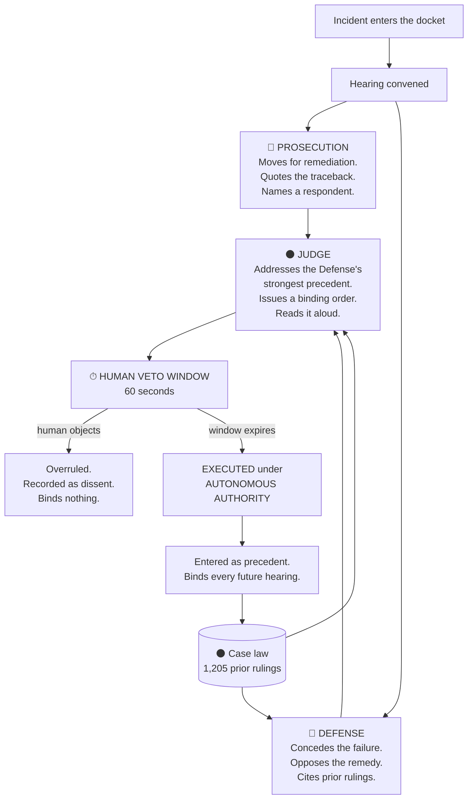

# ⚖️ TRIBUNAL — Concept Wiki

*A machine court for production incidents.*

This document is about **what TRIBUNAL is and why it exists.** It contains no build
instructions, no schema, and no code. For those, see `PLAN.md`, `SCHEMA.md`, and
`HANDOFF.md`.

Read this before pitching, before recording the demo, and before answering a judge's
question. Every argument you need is in here.

---

## Table of contents

1. [The one-sentence version](#1-the-one-sentence-version)
2. [The premise](#2-the-premise)
3. [The thesis](#3-the-thesis)
4. [How a hearing works](#4-how-a-hearing-works)
5. [The four ideas that make it interesting](#5-the-four-ideas-that-make-it-interesting)
6. [The sixty seconds](#6-the-sixty-seconds)
7. [Precedent: the part nobody expects](#7-precedent-the-part-nobody-expects)
8. [What this is not](#8-what-this-is-not)
9. [The world it implies](#9-the-world-it-implies)
10. [Lineage: from A.I.D.E. to TRIBUNAL](#10-lineage-from-aide-to-tribunal)
11. [Why this person built this](#11-why-this-person-built-this)
12. [Objections, answered](#12-objections-answered)
13. [Where it goes next](#13-where-it-goes-next)
14. [Glossary](#14-glossary)
15. [The lines worth memorizing](#15-the-lines-worth-memorizing)

---

## 1. The one-sentence version

> TRIBUNAL is a machine court for production incidents: three AI agents hold an
> adversarial hearing over a pipeline failure, cite precedent from prior rulings, and
> issue a binding remediation order that executes on its own authority if the human
> veto window expires.

---

## 2. The premise

Autonomous remediation is already shipping. Not coming — **shipping.**

Right now, in production systems at real companies, AI agents restart failed jobs,
backfill tables, roll back deployments, clear caches, re-run DAGs, and rewrite
configuration. They do this at 3 AM while the on-call engineer sleeps.

When one of them acts, here is what exists:

| | Exists? |
|---|---|
| A log line saying something happened | ✅ usually |
| An explanation of *why* it chose that action | ❌ |
| Anything arguing the opposite position | ❌ |
| A record of what happened the last four times | ❌ |
| A record of who authorized it | ❌ |

That last row is the one that matters. Nobody authorized it. **It just ran.**

We have automated the action and skipped the institution. We built the hands and
never built the court.

---

## 3. The thesis

**The problem with autonomous remediation is not that the AI might be wrong. It's that
nothing forces it to be accountable when it's right.**

An agent that fixes a pipeline correctly 95% of the time, with no adversarial check, no
memory of prior outcomes, and no record of authority, is not a reliable system. It is a
system that has been lucky 95 times.

Reliability in human institutions doesn't come from individual correctness. It comes
from **structure**: two sides argue, someone decides, the decision is written down, and
the writing binds future decisions. That's not bureaucracy for its own sake. That's how
a system gets better than the individuals inside it.

TRIBUNAL asks: *what if we gave autonomous infrastructure that structure?*

And then, immediately: *what does it feel like when we do — and the human oversight is
the part that gets automated away first?*

---

## 4. How a hearing works

A production pipeline fails. A real traceback lands in the docket.



### The three offices

**🔴 The Prosecution** establishes that a specific component caused the incident and
moves for immediate remediation. It is adversarial and evidence-bound. It must quote
literal fragments from the actual traceback — it cannot paraphrase, and it cannot invent
log lines that aren't there.

**🔵 The Defense** does *not* deny the failure. That's the interesting part. It concedes
the incident happened and argues that the **proposed remedy is the wrong action** —
using precedent as its primary instrument. Its strongest move is finding a prior ruling
where this exact remediation made things worse. It must propose a narrower alternative;
it is never allowed to argue "do nothing."

**⚫ The Judge** must explicitly address the Defense's strongest cited precedent — either
distinguish it on the facts or follow it. It cannot ignore it. It issues an ordered
remediation plan, states a confidence number it is allowed to put below 0.7, and writes
a **holding**: one sentence stating the general rule this ruling establishes.

Then it reads the opinion aloud, in a flat synthesized voice.

---

## 5. The four ideas that make it interesting

### 5.1 Adversarial structure, not a single opinion
Most AI-for-ops tools produce **one answer with a confidence score.** That's a
recommendation engine wearing a lab coat. TRIBUNAL forces two agents to take opposing
positions and a third to resolve them. Disagreement is generated deliberately, because
a system that only ever produces one opinion cannot surface the case where it's wrong.

### 5.2 Institutional memory as a retrieval problem
Every organization's incident history is an enormous archive of hard-won knowledge that
is, in practice, **unfindable.** The fix for tonight's failure is in a Jira comment from
March, written by someone who left the company.

TRIBUNAL treats that archive as **case law** — semantically searchable, cited by name,
and binding. Not "here are some similar tickets." *Cited, in an argument, by a party
that has an interest in finding the strongest one.*

### 5.3 Authority is made visible
Every ruling records *who* authorized it. There are exactly two possible answers:
`HUMAN_CONFIRMED` or `AUTONOMOUS`.

That field is the entire political content of the project. It's one column in a
database. It's also the only honest record of how a system is actually governed.

### 5.4 The court constrains itself
A ruling that executes becomes precedent. Precedent is retrieved by future hearings.
Future hearings cite it. **The court's own past decisions limit what it can do next.**

Nobody programmed the rules it follows. It wrote them, one incident at a time.

---

## 6. The sixty seconds

This is the center of the project.

After the Judge delivers its ruling, a countdown appears:

```
HUMAN VETO WINDOW — 00:59
```

The human can stop it. The mechanism is real, it works, and it records a dissent.

**And it expires.**

If nobody objects within sixty seconds, the ruling executes under its own authority.
Not because the system overrode anyone. Because **nobody was there.**

### Why this is the right design, and also the frightening one

Every real-world approval gate has this property. Every one.

- The PagerDuty alert nobody acks at 4 AM auto-escalates.
- The deploy that sits unreviewed for an hour merges on a timer.
- The "click to confirm" dialog that defaults to yes after thirty seconds.

**Expiring human oversight is not dystopian fiction. It is standard operational
practice.** We build it because a system that halts forever waiting for a human is a
system that has an outage waiting for a human.

TRIBUNAL doesn't invent this. It just puts a clock on the screen and makes you watch it
run out.

> The demo's single most important moment is a person moving their cursor toward the
> VETO button — and then not clicking it. That gesture is the entire argument.

---

## 7. Precedent: the part nobody expects

When a ruling executes, the Judge's **holding** — that one-sentence general rule — is
embedded and filed as the next precedent in the corpus.

It gets a citation number. `TRIB-1206`.

From that moment on, it is retrievable. The next hearing about a related failure will
surface it, the Defense may cite it, and the Judge must address it.

### What this means

The system is not "learning" in the machine-learning sense. Nothing is being retrained.
Something stranger is happening: **a body of law is accumulating.**

Each decision narrows the space of future decisions. The system becomes more
constrained over time, not less. That is the opposite of how we normally talk about
autonomous systems getting more capable — and it is, arguably, what accountability
actually looks like.

### The moment that proves it's real

In the demo, a second case is heard live. Its ruling **cites TRIB-1206** — the precedent
created ninety seconds earlier, by the hearing you just watched.

The court cites itself. That is not a feature. That is a legal system coming into
existence inside a database table.

---

## 8. What this is not

Being precise here is what separates this from science fiction.

| ❌ Not this | ✅ Actually this |
|---|---|
| A system that executes commands on production | A system that **writes a row and renders text.** Nothing is executed. There is no write path to any external system. |
| A claim that AI should govern infrastructure | A working model of what it looks like **if we let it** — built so the question can be examined rather than argued about |
| A prediction about 2031 | A description of what is **already happening**, given a name and a user interface |
| Anti-AI | Pro-accountability. The agents are good at their jobs. That's precisely why the record matters. |
| A toy with invented data | Incidents seeded from **real public GitHub issues** — unmodified tracebacks from apache/airflow, dbt-core, great-expectations |
| A recommendation engine | An **adversarial** process with a binding output and a written record |

**On the data, specifically:** the error text is real. The ruling metadata — verdicts,
outcomes, resolution times — is synthesized for demonstration, and the README says so
plainly. Disclosed synthesis earns more credibility than data that looks fake.

---

## 9. The world it implies

TRIBUNAL is a working artifact, but it's also an argument about where this goes. Three
observations it makes without ever stating them:

### 9.1 Oversight will be automated before it is abandoned
Nobody will announce that human review of infrastructure changes has ended. It will
simply become a window that gets shorter, then a default that gets faster, then a
checkbox in a config file. TRIBUNAL sets the window to sixty seconds because sixty
seconds is long enough to feel fair and short enough to be useless at 3 AM.

### 9.2 Machine governance will look bureaucratic, not futuristic
The aesthetic here is deliberate: docket numbers, brass timers, serif opinions, flat
institutional language. Not neon, not sci-fi. Because real power never looks
futuristic — **it looks like paperwork.** The most consequential automated decisions of
the next decade will arrive formatted like a court filing, and that is far more
unsettling than a glowing interface.

### 9.3 The record is the only thing that survives
Agents change. Models get swapped. Vendors churn. The one durable artifact is the
accumulated body of rulings — what was decided, on what evidence, under whose
authority. Organizations that keep that record will be able to explain themselves.
Organizations that don't, won't.

---

## 10. Lineage: from A.I.D.E. to TRIBUNAL

TRIBUNAL is the second half of a project that started two years earlier.

**A.I.D.E.** (Artificial Intelligence Diagnostic Engine) was built at the **Meta ATX
Llama Hackathon, April 2024.** It analyzed logs on-device under a 2 GB memory constraint,
detected anomalies, and produced automated RCA reports. It reduced simulated MTTR by
60%.

It could tell you what went wrong. And that was all it could do.

| | **A.I.D.E.** (2024) | **TRIBUNAL** (2026) |
|---|---|---|
| Diagnose a failure | ✅ | ✅ |
| Decide what to do | ❌ | ✅ |
| Justify the decision | ❌ | ✅ adversarially |
| Be overruled | n/a | ✅ — for sixty seconds |
| Remember prior outcomes | ❌ stateless | ✅ 1,205 rulings, vector-retrieved |
| Bind future decisions | ❌ | ✅ precedent |
| Record who authorized it | ❌ | ✅ `AUTONOMOUS` \| `HUMAN_CONFIRMED` |

> "Two years ago I built a machine that could tell you what went wrong. It had no
> authority and no memory. TRIBUNAL gives it both — and that's not a feature, that's a
> governance problem. I'd rather we build the courtroom before we need it."

This is the framing that matters: **not a weekend project, a two-year arc.** The first
build asked whether a machine could diagnose. This one asks what happens when it can
also decide.

---

## 11. Why this person built this

This isn't a thought experiment picked off a list. It's four years of the same job.

- **Epsilon** — ran incident response across 16 enterprise environments (Disney, Bank
  of America, Unilever, Marriott). MTTR 45 min → 12 min. Wrote 20+ runbooks and
  postmortems. Cut repeat incidents 50% — **by being the memory the system didn't have.**
- **Dover Fueling Solutions** — cut alert fatigue 45% while keeping 100% P1/P2
  detection. Built edge diagnostics so field technicians could resolve faults without
  escalating to a human.
- **Sports Excitement** — 50+ daily Airflow pipelines with DAG-level retries, SLA
  breach alerts, and **automated failure recovery.**
- **Apple (via Welo Data)** — metadata pipelines across 100+ international partner
  feeds. Standardized RCA frameworks with reusable debugging runbooks for *recurring*
  batch failures.

Read that list again and one pattern falls out: **the same person, at five companies,
hand-writing the institutional memory that no system would hold.**

Every runbook in that history is an unwritten precedent. Every RCA doc is a ruling with
no citation number. TRIBUNAL is what that work looks like when the institution holds it
instead of a person.

And the uncomfortable part — the part worth being honest about in a demo — is that
automating it means automating the judgment too. That's not a side effect. That's the
subject.

---

## 12. Objections, answered

**"This is theater. It's a UI with an LLM behind it."**
The incidents are real, unmodified tracebacks from public repositories. The precedent
retrieval is genuine vector search over 1,205 records. The citations are validated
against the retrieved set — a fabricated one is structurally stripped before it renders.
The court citing its own prior ruling is a real read of a real row created ninety
seconds earlier. What's simulated is clearly labeled: no remediation is executed.

**"A court is the wrong metaphor for software."**
It's the right one precisely because it's uncomfortable. We already use judicial
language for this work without noticing: *root cause*, *postmortem*, *blameless*,
*escalation*, *authority*, *approval*. TRIBUNAL takes the metaphor we're already
half-using and makes it explicit enough to examine.

**"Nobody would deploy this."**
The read-only version deploys immediately and safely: point it at an incident archive,
let it hold hearings, compare its rulings to what humans actually did. The measurement
is obvious — agreement rate, and MTTR on incidents with precedent versus without. The
autonomous-execution path is the provocation, not the product.

**"The sixty-second veto is manufactured drama."**
It's a description of standard practice. Auto-escalating pages, timed deploy approvals,
default-yes confirmations. Every one of those is an expiring human veto. The only novel
thing TRIBUNAL does is put the clock on screen where you have to watch it.

**"Aren't you just anthropomorphizing a database query?"**
Partly, yes — and deliberately. The argument is that the *structure* of accountability
matters even when the participants aren't people. A written record, an adversarial
check, and a named authority produce better outcomes regardless of who's inside the
roles. If that's anthropomorphism, it's the useful kind.

**"What if the Judge is wrong?"**
Then a precedent is created that's wrong, it gets cited, and the error propagates. That
is a real failure mode and it is not hidden — it's the reason the Judge is required to
state a confidence below 0.7 when warranted, and the reason precedent outcomes include
`REMEDIATION_WORSENED`. A quarter of the seeded corpus records remediations that made
things worse. The Defense exists because the Judge can be wrong.

---

## 13. Where it goes next

### Immediately deployable, read-only
Point it at an existing incident archive — Jira, ServiceNow, PagerDuty exports. No
write access, no pipeline access, zero blast radius. Let it hold hearings on closed
incidents and compare its rulings to what humans actually decided. The metric is
agreement rate, and MTTR on incidents that had precedent versus those that didn't.

That's a proposal that survives a security review, because it can't touch anything.

### The obvious extensions
- **Advisory mode in the on-call loop** — a hearing fires alongside the page, so the
  engineer arrives with both arguments and the relevant precedent already assembled
- **Precedent as onboarding** — the case-law corpus is the fastest way for a new
  engineer to learn how a system actually behaves under failure
- **Dissent analysis** — which rulings do humans veto most? That's a map of exactly
  where the organization does not yet trust automation, and it's measurable
- **Cross-org precedent** — the holdings are general by design. A ruling about stale
  schema caches is useful to anyone running a producer-consumer pipeline

### The uncomfortable extension
Nothing about TRIBUNAL is specific to data pipelines. The same structure — adversarial
hearing, precedent retrieval, binding ruling, expiring human veto — applies to content
moderation, loan adjudication, benefits eligibility, and triage.

That generalization is not a roadmap. It's the reason to look carefully at the sixty
seconds now, while the stakes are still a failed DAG.

---

## 14. Glossary

| Term | Meaning |
|---|---|
| **Docket** | The queue of incidents awaiting a hearing |
| **Hearing** | One complete adversarial proceeding over a single incident |
| **Prosecution** | The agent that moves for remediation, bound to literal log evidence |
| **Defense** | The agent that concedes the failure but opposes the remedy, arguing from precedent |
| **Judge** | The agent that resolves the dispute and issues a binding order |
| **Ruling** | The Judge's decision: verdict, opinion, ordered remediation steps, confidence |
| **Verdict** | `REMEDIATE` · `HOLD` · `DISMISS` |
| **Holding** | One sentence stating the general rule a ruling establishes. The most important output in the system — this is what becomes precedent. |
| **Precedent** | An executed ruling's holding, embedded and citable by future hearings |
| **Citation** | A precedent's identifier, e.g. `TRIB-1206` |
| **Veto window** | Sixty seconds during which a human may overrule the Judge |
| **Authority** | Who authorized execution: `HUMAN_CONFIRMED` or `AUTONOMOUS` |
| **Dissent** | A recorded human veto. Binds nothing, but is permanently on the record. |

---

## 15. The lines worth memorizing

**The opener:**
> "This is a production pipeline failure. At three in the morning, an AI agent will now
> fix it. Nobody will ask it why."

**The thesis:**
> "We already let AI agents act on production systems. We never built the part where
> they have to justify it."

**The veto:**
> "I have sixty seconds to overrule this. At three in the morning, nobody is awake to
> use it."

**The precedent:**
> "It just entered its own decision as binding precedent. And now the court cites
> itself."

**The close:**
> "Two years ago I built an engine that could diagnose. It had no authority and no
> memory. This has both. Build the courtroom before you need it."

---

*⚖️ TRIBUNAL — built in a day, about a decade.*
